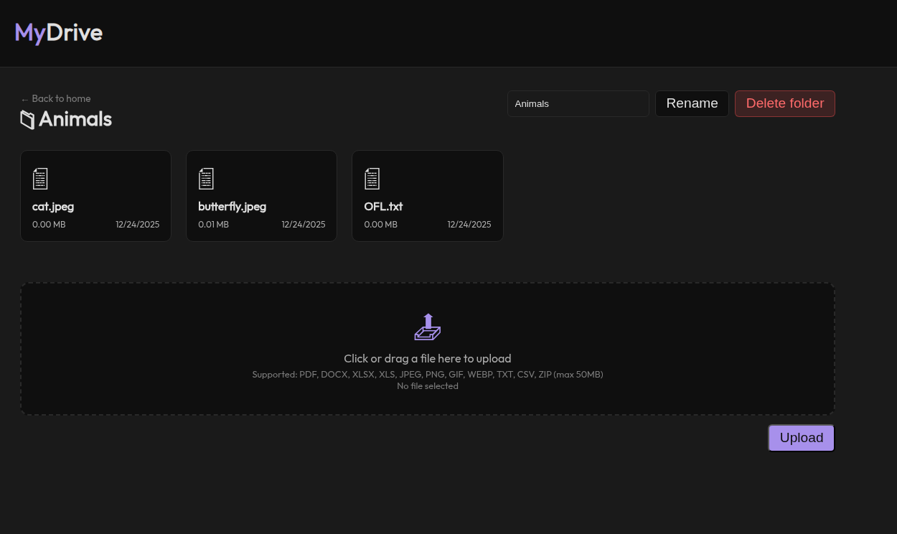

# File Uploader

A modern full‑stack file management app built with Node.js and Express that lets users securely upload, organize, and manage files in a hierarchical folder structure with cloud storage (Supabase) for file contents and PostgreSQL for metadata.

Live demo: https://file-uploader-oz24.onrender.com/

## Features

- User authentication (session-based) and access control
- Secure file upload with validation and size limits
- Hierarchical folders with cascade deletion
- File download via Supabase
- Rename files and folders
- Responsive UI for desktop and mobile
- Session persistence in the database

## Tech stack

- Backend: Node.js (Bun-compatible), Express, Passport.js, Prisma (PostgreSQL)
- Storage: Supabase (object storage) for files, PostgreSQL for metadata
- Templates: EJS
- Other libs: Multer, bcrypt, express-validator, express-session, connect-flash

## Prerequisites

- Node.js (or Bun) and npm/yarn
- PostgreSQL database
- Supabase project (for storage and access keys)
- Environment variables configured (see below)

## Environment variables

Create a .env file in the project root with at least:

- DATABASE_URL=<postgres://...>
- SUPABASE_URL=<https://...>
- SUPABASE_KEY=<service_role_or_anon_key>
- SESSION_SECRET=<secure_random_string>
- NODE_ENV="development"

(Adjust names if your app reads different keys.)

## Installation

1. Clone the repo:
   git clone <repo_url>
2. Install dependencies:
   npm install
3. Setup the database and run Prisma migrations:
   npx prisma migrate deploy
   (or npx prisma migrate dev for local development)
4. Create and populate .env as above.

## Running

- Development:
  npm run dev
- Production:
  npm start

Open http://localhost:3000 (or the port set in PORT).

## Usage

- Register an account and sign in
- Create folders and upload files to organize content
- Download files via secure links; rename or delete items as needed

## Contributing

PRs welcome. Keep changes focused, add tests where appropriate, and update README or docs for any public API changes.

## License

Open source — use for educational purposes. Add a LICENSE file if you need a specific license.

## Acknowledgments

- The Odin Project (inspiration and structure)
- Supabase (storage)
- Prisma (ORM)